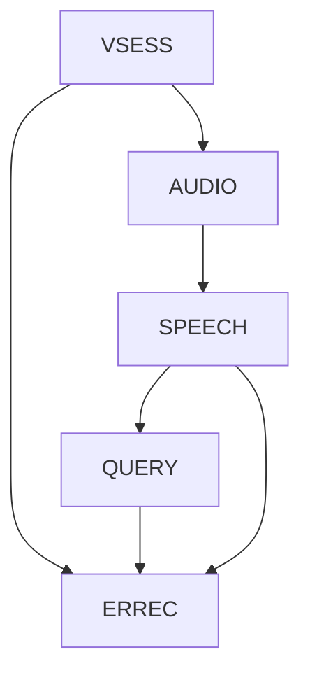

# 03 - Functional Groups

## Overview

The voice assistant is organized into 5 functional groups, each handling a distinct capability domain.

```
┌─────────────────────────────────────────────────────────────┐
│                     VSESS (Session)                         │
│  ┌─────────────────────────────────────────────────────────┐│
│  │                    AUDIO (Capture)                      ││
│  │  ┌───────────────────────────────────────────────────┐  ││
│  │  │              SPEECH (Processing)                  │  ││
│  │  │  ┌─────────────────────────────────────────────┐  │  ││
│  │  │  │           QUERY (Execution)                 │  │  ││
│  │  │  └─────────────────────────────────────────────┘  │  ││
│  │  └───────────────────────────────────────────────────┘  ││
│  └─────────────────────────────────────────────────────────┘│
│                      ERREC (Recovery)                       │
└─────────────────────────────────────────────────────────────┘
```

---

## VSESS - Voice Session Management

**Purpose**: Manage the lifecycle of voice interactions from activation to completion.

**Responsibilities**:
- Session initialization and teardown
- Wake word detection
- Connection state management
- Session timeout handling
- Multi-turn context persistence

**State Machine**:
```
IDLE → LISTENING → PROCESSING → SPEAKING → IDLE
         ↑____________↓
         (interruption)
```

**Use Case File**: [UC-VSESS.md](./UC-VSESS.md)

---

## AUDIO - Audio Capture & Playback

**Purpose**: Handle all audio I/O including microphone capture, speaker playback, and audio session management.

**Responsibilities**:
- Mic capture via `react-native-webrtc` `mediaDevices.getUserMedia({ audio: true })`
- Speaker output via WebRTC `ontrack` event + `react-native-incall-manager`
- Audio session config via `expo-av` `Audio.setAudioModeAsync({ playsInSilentModeIOS: true })`
- Background audio session
- Audio ducking (lower other audio)
- Bluetooth/headphone routing

**Key Flows**:
- Capture: `getUserMedia` → `pc.addTrack` → WebRTC to OpenAI
- Playback: OpenAI → WebRTC `ontrack` → speaker via `InCallManager`

**Use Case File**: [UC-AUDIO.md](./UC-AUDIO.md)

---

## SPEECH - Speech Processing

**Purpose**: Convert between speech and text with high accuracy and low latency.

**Responsibilities**:
- Speech-to-text transcription
- Text-to-speech synthesis
- Voice Activity Detection (VAD)
- Interruption detection (barge-in)
- Noise suppression
- Confidence scoring

**Provider**: OpenAI Realtime API (single provider, no fallback)

| Function | Provider | Notes |
|----------|----------|-------|
| STT | OpenAI Realtime (built-in) | Server-side, no separate service |
| TTS | OpenAI Realtime (built-in) | Server-side, voices: `cedar` or `marin` |
| VAD | OpenAI Realtime (`server_vad` or `semantic_vad`) | Server-side, configurable |

**Use Case File**: [UC-SPEECH.md](./UC-SPEECH.md)

---

## QUERY - Query & Action Execution

**Purpose**: Process user intents and execute corresponding actions with result narration.

**Responsibilities**:
- Intent classification
- Parameter extraction
- Action routing to Holocron APIs
- Result formatting for speech
- Progress updates during execution
- Confirmation handling

**Supported Actions**:
- Knowledge queries (search, lookup)
- Task management (create, list, update)
- Calendar operations
- Note capture
- Navigation commands

**Use Case File**: [UC-QUERY.md](./UC-QUERY.md)

---

## ERREC - Error Recovery

**Purpose**: Handle errors gracefully with spoken guidance to resolution.

**Responsibilities**:
- Error classification (transient vs permanent)
- Recovery suggestions
- Retry logic with backoff
- Graceful degradation
- User guidance narration
- Fallback mode activation

**Error Categories**:
| Category | Example | Recovery |
|----------|---------|----------|
| Network | Connection lost | Retry with audio feedback |
| Recognition | Low confidence | Ask for repetition |
| Execution | API failure | Explain and suggest alternative |
| Permission | Mic denied | Guide to settings |

**Use Case File**: [UC-ERREC.md](./UC-ERREC.md)

---

## Group Dependencies



| Depends On | Required By |
|------------|-------------|
| AUDIO | VSESS, SPEECH |
| SPEECH | QUERY |
| ERREC | VSESS, SPEECH, QUERY |
