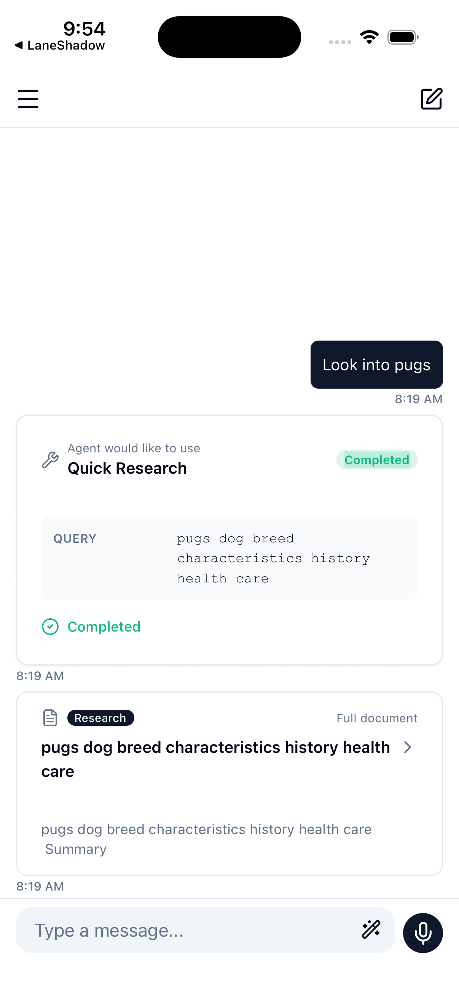
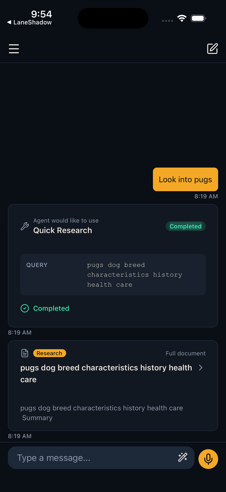
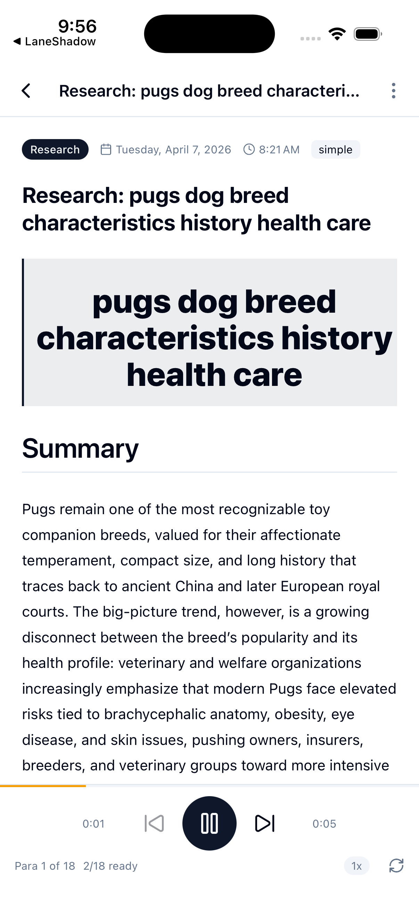
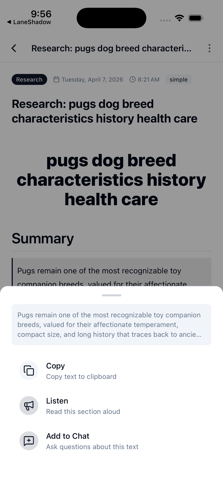
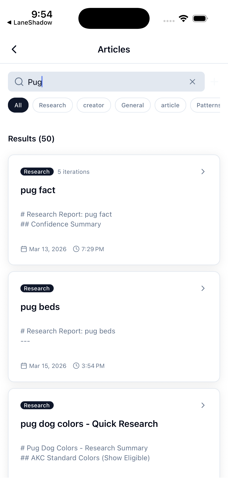
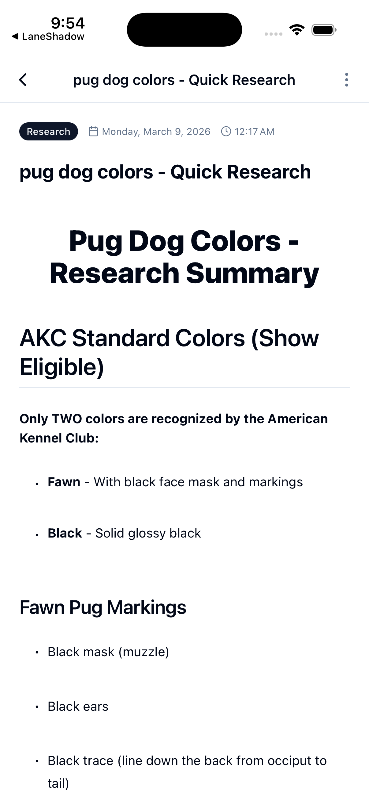
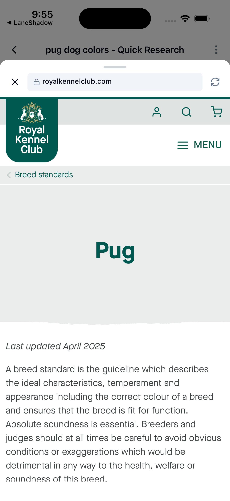

# Holocron

Personal knowledge management and research assistant powered by Convex and React Native.

## Overview

Holocron is a cross-platform application that helps you manage documents, conduct research, and interact with an AI-powered chat interface. It features:

- AI-powered chat interface with slash commands
- Full-text and vector search across documents
- Deep research workflows with multi-agent orchestration
- Real-time updates and progress tracking
- Cross-platform support (iOS, Android, Web)

## ✨ Features

### AI-Powered Chat
<a href="assets/readme/features/chat.png">
  
</a>
<a href="assets/readme/features/chat-dark.png">
  
</a>

Natural conversations with slash commands (`/search`, `/browse`, `/stats`) and real-time AI responses. Click images to view full size.

### Article Management
<a href="assets/readme/features/article-listen.png">
  
</a>
<a href="assets/readme/features/article-menu.png">
  
</a>
<a href="assets/readme/features/article-search.png">
  
</a>

Browse, search, and listen to articles from your knowledge base. Full-text search with instant results and audio playback support.

### Article Details
<a href="assets/readme/features/article-details.png">
  
</a>
<a href="assets/readme/features/article-webview.png">
  
</a>

Read article details or open in integrated web view for full content. Save highlights and manage your reading list.

---

**Click any thumbnail to view the full-size screenshot.**

## 🚀 Getting Started

**New here?** Start with [**docs/LAY-OF-THE-LAND.md**](docs/LAY-OF-THE-LAND.md) for a visual guide to the codebase structure.

### Quick Start (5 minutes)

```bash
# 1. Install dependencies
pnpm install

# 2. Start Convex backend
npx convex dev

# 3. Run the app
pnpm start
```

**What's happening:**
- `npx convex dev` starts your backend server and generates types
- `pnpm start` opens Expo DevTools - press `i` for iOS Simulator or `a` for Android Emulator

### Next Steps

- **Browse** the app and try slash commands (`/help`, `/search`, `/browse`)
- **Read** [docs/LAY-OF-THE-LAND.md](docs/LAY-OF-THE-LAND.md) for architecture overview
- **Explore** `convex/schema.ts` to see data models
- **Check** `CLAUDE.md` for development standards

## Tech Stack

### Frontend
- **Framework**: React Native with Expo Router
- **Styling**: NativeWind (Tailwind for React Native)
- **Navigation**: Expo Router (file-based routing)
- **UI Components**: React Native Paper
- **State Management**: Convex useQuery/useMutation (reactive)

### Backend
- **Backend-as-a-Service**: Convex
- **Database**: Convex (with vector embeddings for semantic search)
- **Real-time**: Automatic reactivity via Convex subscriptions

### AI & Machine Learning
- **AI Provider**: Z.ai (primary AI services)
- **Vector Embeddings**: 1536-dimensional embeddings for semantic search
- **Search Capabilities**: Full-text, vector, and hybrid search

### Development Tools
- **Language**: TypeScript
- **Package Manager**: pnpm
- **Testing**: Vitest
- **CLI**: Python CLI for database operations

## Architecture

```mermaid
graph TD
    subgraph Client
        RN[React Native App]
        CLI[Python CLI]
    end

    subgraph Convex
        Queries[ Queries]
        Mutations[ Mutations]
        Actions[ Actions]
        DB[(Database)]
        Vectors[Vector Embeddings]
    end

    subgraph External
        OpenAI[OpenAI GPT-4]
        ArXiv[ArXiv API]
        Web[Web Search]
    end

    RN -->|useQuery| Queries
    RN -->|useMutation| Mutations
    RN -->|useAction| Actions
    CLI -->|HTTP| Queries

    Queries --> DB
    Queries --> Vectors
    Mutations --> DB
    Mutations --> Vectors

    Actions -->|Chat| OpenAI
    Actions -->|Research| ArXiv
    Actions -->|Search| Web

    style RN fill:#61DAFB
    style Convex fill:#24292E
    style DB fill:#4DB33D
    style OpenAI fill:#00A67E
    style ArXiv fill:#B31B1B
    style Web fill:#4285F4
```



### Backend Migration (Supabase → Convex)

This project has been migrated from Supabase to Convex for improved developer experience and simplified real-time patterns. See [Migration Summary](.spec/MIGRATION-SUMMARY.md) for details.

**Key Benefits**:
- Automatic reactivity (no manual subscription management)
- 30%+ code reduction
- Unified client interface for mobile and CLI
- Better observability with Convex dashboard
- Type-safe API from generated schema

### Schema Overview

Holocron uses Convex for data persistence with 58+ tables organized by domain:

### Core
| Table | Description |
|-------|-------------|
| `conversations` | Chat conversation threads |
| `chatMessages` | Individual messages within conversations |
| `documents` | Knowledge base documents with vector embeddings (1024 dimensions) |
| `tasks` | Background task tracking |
| `toolCalls` | LLM tool call tracking |
| `notifications` | User notifications |
| `userPreferences` | User settings and preferences |

### Research
| Table | Description |
|-------|-------------|
| `researchSessions` | Basic research workflow sessions |
| `researchIterations` | Individual research iteration results |
| `researchFindings` | Research findings and sources |
| `deepResearchSessions` | Deep research workflow sessions (multi-agent) |
| `deepResearchIterations` | Deep research iteration results |
| `citations` | Source citations for research findings |

### Subscriptions & Feeds
| Table | Description |
|-------|-------------|
| `subscriptionSources` | YouTube, newsletter, changelog sources |
| `subscriptionContent` | Fetched content from subscriptions |
| `subscriptionFilters` | Content filtering rules |
| `subscriptionLinks` | Subscription feed links |
| `feedItems` | RSS/Atom feed items |
| `feedSessions` | Feed browsing sessions |
| `feedSettings` | Feed configuration |
| `whatsNewReports` | Daily tech news briefings |

### Tools & Agents
| Table | Description |
|-------|-------------|
| `toolbeltTools` | Available tools and utilities |
| `agentPlans` | Agent execution plans |
| `agentPlanSteps` | Individual plan steps |
| `executionPlans` | Workflow execution plans |
| `planApprovals` | Plan approval tracking |
| `assimilationSessions` | GitHub repository analysis |
| `assimilationIterations` | Analysis iterations |
| `assimilationMetadata` | Repository metadata |

### Shopping & Deals
| Table | Description |
|-------|-------------|
| `shopSessions` | Shopping research sessions |
| `shopListings` | Product listings across retailers |

### Voice & Audio
| Table | Description |
|-------|-------------|
| `voiceSessions` | Voice interaction sessions |
| `voiceCommands` | Voice command processing |
| `audioSegments` | Audio transcript segments |
| `audioJobs` | Audio processing jobs |
| `videoTranscripts` | YouTube video transcripts |
| `transcriptJobs` | Transcript generation jobs |
| `creatorProfiles` | YouTube creator profiles |

### Business Analysis
| Table | Description |
|-------|-------------|
| `improvementRequests` | Product improvement tracking |
| `improvementImages` | Improvement screenshots |
| `revenueValidationSessions` | Revenue validation workflows |
| `revenueValidationEvidence` | Revenue validation data |
| `revenueValidationCompetitors` | Competitor revenue data |
| `competitiveAnalysisSessions` | Competitive analysis workflows |
| `competitiveAnalysisCompetitors` | Competitor profiles |
| `competitiveAnalysisFeatures` | Feature comparisons |
| `aiRoiSessions` | AI ROI analysis sessions |
| `aiRoiOpportunities` | ROI opportunities |
| `aiRoiEvidence` | ROI calculation evidence |

### Travel
| Table | Description |
|-------|-------------|
| `flightsSessions` | Flight search sessions |
| `flightsRoutes` | Flight route data |
| `flightsPriceCalendar` | Price tracking data |

### System
| Table | Description |
|-------|-------------|
| `rateLimitTracking` | API rate limit tracking |
| `rateLimits` | Rate limit configuration |
| `imports` | Data import tracking |

*Full schema defined in [`convex/schema.ts`](convex/schema.ts)*

## Setup

### Prerequisites

- Node.js 18+ and pnpm
- Expo CLI (`npm install -g expo-cli`)
- Convex account (sign up at [convex.dev](https://convex.dev))
- LLM provider API key (OpenAI, Z.ai, or compatible provider)

### 1. Install Dependencies

```bash
pnpm install
```

### 2. Configure Convex

Initialize your Convex project:

```bash
npx convex dev
```

This will:
1. Create a new Convex project (or connect to existing)
2. Generate `.env.local` with your `CONVEX_URL`
3. Deploy your schema and functions
4. Start the Convex dev server

### 3. Environment Variables

Create a `.env` file in the project root:

```bash
# Convex Backend
EXPO_PUBLIC_CONVEX_URL="https://your-project.convex.cloud"

# LLM Provider API Key (OpenAI, Z.ai, or compatible provider)
EXPO_PUBLIC_LLM_API_KEY="your-api-key-here"

# Langfuse (Optional - for observability)
LANGFUSE_BASE_URL="https://us.cloud.langfuse.com"
LANGFUSE_SECRET_KEY="your-key"
LANGFUSE_PUBLIC_KEY="your-key"

# Structured Logging
EXPO_PUBLIC_LOGGING_ENABLED=true
EXPO_PUBLIC_LOG_LEVEL=info
```

**Getting your Convex URL**:
1. Run `npx convex dev`
2. Copy the URL from the terminal output (format: `https://PROJECT_NAME.convex.cloud`)
3. Add it to your `.env` file as `EXPO_PUBLIC_CONVEX_URL`

### 4. Run the App

Start the Expo development server:

```bash
# iOS
pnpm ios

# Android
pnpm android

# Web
pnpm web

# All platforms
pnpm start
```

## Development Workflows

### Running Tests

```bash
# Run all tests
pnpm test

# Run tests in watch mode
pnpm test:watch

# Type checking
pnpm typecheck

# Linting
pnpm lint
```

### Convex Development

The Convex dev server must be running during development:

```bash
npx convex dev
```

This provides:
- Real-time function deployment
- Schema validation
- Live dashboard at `https://dashboard.convex.dev`
- Function logs and debugging

### Storybook (Component Development)

```bash
# iOS
pnpm storybook:ios

# Android
pnpm storybook:android

# Default (platform picker)
pnpm storybook
```

## Project Structure

```
holocron/
├── app/                    # Expo Router screens
│   ├── (drawer)/          # Main app screens (drawer navigation)
│   ├── _layout.tsx        # Root layout with ConvexProvider
│   └── +not-found.tsx     # 404 page
├── components/            # Reusable React Native components
│   └── ui/               # UI primitives
├── convex/               # Convex backend functions
│   ├── schema.ts         # Database schema
│   ├── conversations/    # Conversation CRUD
│   ├── chatMessages/     # Chat message operations
│   ├── documents/        # Document management + search
│   ├── tasks/           # Background task management
│   ├── research/        # Research workflows
│   └── chat/            # Chat AI integration
├── hooks/               # Custom React hooks
├── lib/                 # Utilities and helpers
│   ├── types/          # TypeScript type definitions
│   └── logging/        # Structured logging
├── python/             # Python CLI client
├── scripts/            # Migration and utility scripts
└── tests/              # Test files
    ├── convex/         # Convex function tests
    └── components/     # Component tests
```

## Convex Functions

### Queries (Read Operations)

Queries are reactive and automatically update when data changes:

```typescript
import { useQuery } from 'convex/react'
import { api } from '@/convex/_generated/api'

// List all conversations (auto-updates)
const conversations = useQuery(api.conversations.queries.list)

// Get single conversation by ID
const conversation = useQuery(api.conversations.queries.get, { id })

// Search documents (full-text + vector)
const results = useQuery(api.documents.search.hybridSearch, {
  query: 'machine learning'
})
```

### Mutations (Write Operations)

Mutations modify data and trigger reactive updates:

```typescript
import { useMutation } from 'convex/react'
import { api } from '@/convex/_generated/api'

// Create conversation
const createConversation = useMutation(api.conversations.mutations.create)
await createConversation({ title: 'New Chat' })

// Update conversation
const updateConversation = useMutation(api.conversations.mutations.update)
await updateConversation({ id, title: 'Updated Title' })

// Delete conversation
const deleteConversation = useMutation(api.conversations.mutations.remove)
await deleteConversation({ id })
```

### Actions (External Integrations)

Actions can call external APIs (OpenAI, web scraping, etc.):

```typescript
import { useAction } from 'convex/react'
import { api } from '@/convex/_generated/api'

// Send chat message (calls OpenAI)
const sendMessage = useAction(api.chat.send.send)
await sendMessage({
  conversationId,
  content: 'Hello AI!'
})

// Start research workflow
const startResearch = useAction(api.research.actions.startResearch)
await startResearch({
  query: 'quantum computing',
  researchType: 'quick'
})
```

## Real-time Updates

Convex provides automatic reactivity. No manual subscription management needed:

```typescript
// Component automatically re-renders when task updates
function TaskProgress({ taskId }) {
  const task = useQuery(api.tasks.queries.get, { id: taskId })

  if (!task) return <Loading />
  if (task.status === 'running') return <ProgressBar value={task.progress} />
  if (task.status === 'completed') return <Results data={task.result} />
  if (task.status === 'failed') return <Error message={task.errorMessage} />
}
```

**Before (Supabase)**: 362 lines of subscription management
**After (Convex)**: Direct entity watching with `useQuery`

## Search Capabilities

### Full-Text Search

```typescript
const results = useQuery(api.documents.queries.fullTextSearch, {
  query: 'machine learning',
  limit: 10
})
```

### Vector Search (Semantic)

```typescript
const results = useQuery(api.documents.search.vectorSearch, {
  query: 'machine learning',
  limit: 10
})
```

### Hybrid Search (Best Results)

Combines full-text and vector search with score blending:

```typescript
const results = useQuery(api.documents.search.hybridSearch, {
  query: 'machine learning',
  limit: 10,
  alpha: 0.5  // 0.5 = balanced, 0.0 = FTS only, 1.0 = vector only
})
```

## CLI Tool

The Python CLI provides command-line access to your Holocron database:

```bash
# Search documents
python -m holocron_cli search "machine learning"

# List all documents
python -m holocron_cli list

# Get document by ID
python -m holocron_cli get <doc-id>

# Browse categories
python -m holocron_cli browse

# View statistics
python -m holocron_cli stats
```

See [cli/README.md](cli/README.md) for setup instructions.

## MCP Server Integration

Holocron includes a Model Context Protocol (MCP) server that provides **42 tools** for interacting with your knowledge base, research workflows, subscriptions, and more. The MCP server enables Claude Code and other MCP-compatible clients to seamlessly integrate with Holocron.

### Available MCP Tools

The MCP server provides tools across several categories:

**Search & Retrieval (6 tools)**
- `hybrid_search` - Combined full-text + semantic search
- `search_fts` - Full-text keyword search
- `search_vector` - Semantic vector search
- `get_document` - Retrieve document by ID
- `list_documents` - List documents with pagination
- `share_document` - Publish/unpublish documents

**Research Sessions (2 tools)**
- `get_research_session` - Retrieve research session by ID
- `search_research` - Search research findings

**Document Management (3 tools)**
- `store_document` - Create new document with embeddings
- `update_document` - Update existing document
- `share_document` - Share documents publicly

**Subscriptions (8 tools)**
- `add_subscription` - Add YouTube, newsletter, changelog, Reddit sources
- `remove_subscription` - Remove subscription
- `list_subscriptions` - List subscriptions with filters
- `check_subscriptions` - Fetch new content from sources
- `get_subscription_content` - Get subscription content items
- `set_subscription_filter` - Set keyword/score filters
- `get_subscription_filters` - Get filter rules

**Toolbelt (6 tools)**
- `store_tool` - Store tools with embeddings
- `search_tools` - Search tools (hybrid)
- `get_tool` - Get tool by ID
- `list_tools` - List tools with filters
- `update_tool` - Update tool
- `remove_tool` - Remove tool

**Shopping (3 tools)**
- `shop_products` - Search products across retailers
- `get_shop_session` - Retrieve shop session
- `get_shop_listings` - Get product listings

**What's New (2 tools)**
- `get_whats_new_report` - Get AI news briefing
- `list_whats_new_reports` - List recent reports

**Assimilation (6 tools)**
- `start_assimilation` - Analyze GitHub repo
- `approve_assimilation_plan` - Approve analysis plan
- `reject_assimilation_plan` - Reject with feedback
- `get_assimilation_status` - Get session status
- `cancel_assimilation` - Cancel active session
- `steer_assimilation` - Inject steering notes

**Creator Management (3 tools)**
- `assimilate_creator` - Extract YouTube transcripts
- `get_creator_transcripts` - Get creator transcripts
- `regenerate_transcript` - Re-transcribe video

**Improvement Requests (5 tools)**
- `search_improvements` - Search improvement requests
- `get_improvement` - Get improvement by ID
- `list_improvements` - List improvements
- `add_improvement` - Submit improvement request
- `close_improvement` - Close improvement with evidence

### Setup

To configure the Holocron MCP server with Claude Code, add the following to your `~/.claude/settings.json`:

```json
{
  "mcpServers": {
    "holocron": {
      "type": "stdio",
      "command": "/path/to/bun",
      "args": ["dist/stdio.js"],
      "cwd": "/path/to/holocron/holocron-mcp",
      "env": {
        "HOLOCRON_URL": "https://your-deployment.convex.cloud",
        "HOLOCRON_DEPLOY_KEY": "dev:your-key",
        "HOLOCRON_OPENAI_API_KEY": "sk-your-key"
      }
    }
  }
}
```

Replace the paths and environment variables with your actual values. See [holocron-mcp/MCP-SETUP.md](holocron-mcp/MCP-SETUP.md) for detailed setup instructions.

## Slash Commands

The chat interface supports slash commands:

- `/search <query>` - Search your knowledge base
- `/browse` - Browse documents by category
- `/stats` - View database statistics
- `/help` - Show available commands

## Migration Notes

This project was migrated from Supabase to Convex in March 2026. Key changes:

### Removed
- `@supabase/supabase-js` package
- `lib/supabase.ts` client file
- `useLongRunningTask` hook (362 lines → watch entities directly)
- `use-chat-realtime.ts` (81 lines → automatic reactivity)
- `taskRealtimeRegistry.ts` (127 lines → not needed)
- Manual subscription management (~570 lines total removed)

### Added
- Convex client and React hooks
- Automatic reactivity via `useQuery`
- Simplified background job tracking
- Type-safe API from schema

### Data Migration
All data was successfully migrated with 100% validation pass rate:
- 9 tables migrated
- Vector embeddings preserved (1024 dimensions)
- Foreign key relationships maintained
- Zero data loss

For detailed migration information, see:
- [Migration Summary](.spec/MIGRATION-SUMMARY.md)
- [Migration Analysis](.spec/MIGRATION-ANALYSIS.md)
- [Backend Migration PRD](.spec/prd/12-uc-backend-migration.md)

## Contributing

This is a personal project, but contributions are welcome!

### Development Standards

- **Code Style:** See [CLAUDE.md](CLAUDE.md) for React Native patterns and rules
- **Commit Messages:** Use conventional commits (`feat:`, `fix:`, `refactor:`, etc.)
- **Pre-commit Hooks:** All commits must pass typecheck, lint, and tests

### Making Changes

1. **Create a branch:** `git checkout -b feature/your-feature`
2. **Make changes:** Follow patterns in [CLAUDE.md](CLAUDE.md)
3. **Test locally:** `pnpm typecheck && pnpm lint && pnpm test`
4. **Commit:** Pre-commit hooks will run automatically
5. **Push:** `git push origin feature/your-feature`
6. **PR:** Create a pull request

### Adding Features

Check `.spec/prd/` for planned features and specifications. If you're adding something new:
1. Create a spec document in `.spec/prd/`
2. Run `/kb-project-plan` to generate tasks (if using Claude Code)
3. Implement following React Native rules in [CLAUDE.md](CLAUDE.md)

### Reporting Issues

If you find bugs or have suggestions:
1. Check existing issues in GitHub
2. Create a new issue with:
   - Clear title and description
   - Steps to reproduce (for bugs)
   - Expected vs actual behavior
   - Screenshots if applicable

## License

This project is licensed under the MIT License - see the [LICENSE](LICENSE) file for details.
