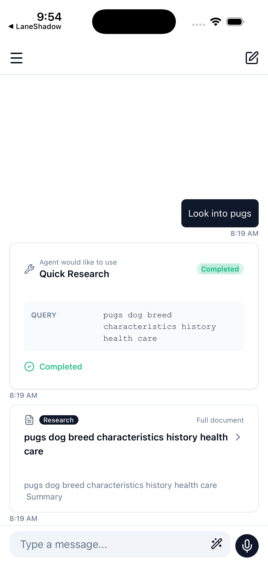
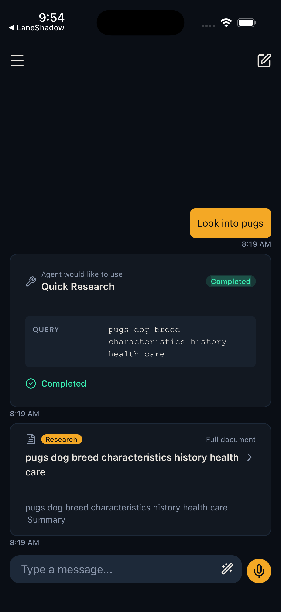
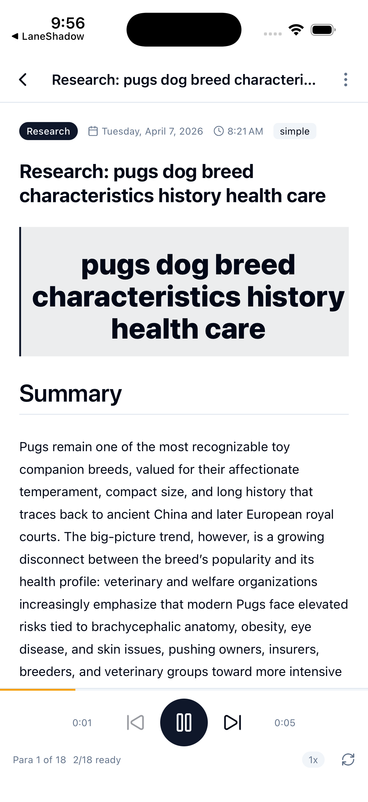
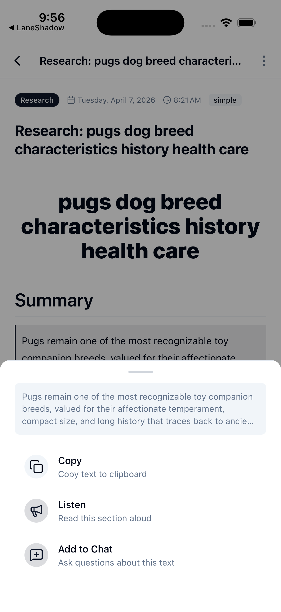
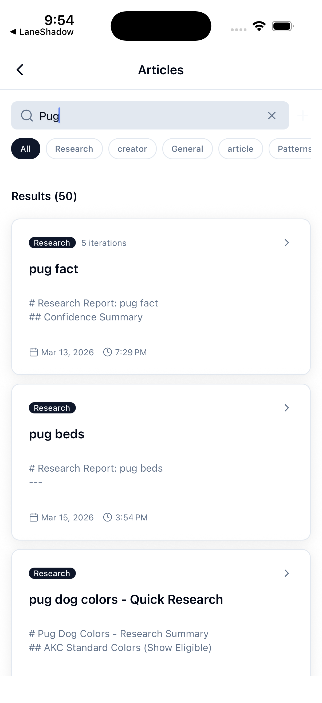
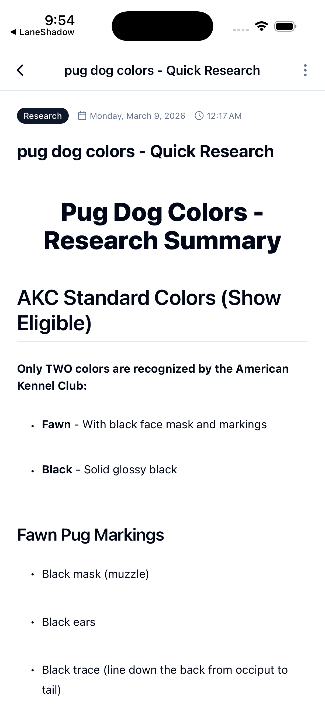
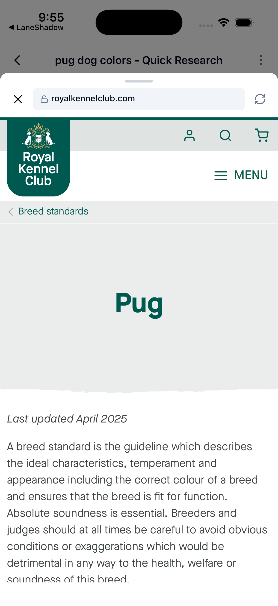
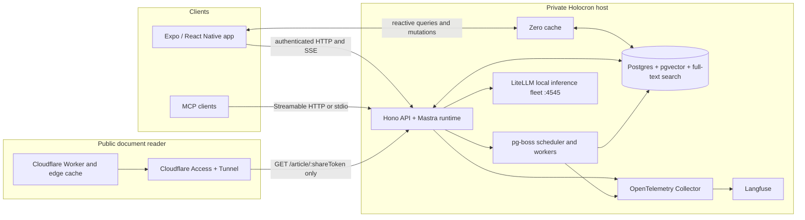

# Holocron

Holocron is a local-first personal knowledge system for capturing documents, searching a private
library, running durable research missions, and working with that library from a native app or any
Model Context Protocol (MCP) client.

The MK-VI refactor replaced the active Convex runtime with an Expo/Zero client and a
Mastra + Hono + Postgres platform. Reasoning is local-first through the LiteLLM fleet, while
OpenTelemetry and Langfuse make mission and inference behavior inspectable.

## What it does

- Conversational access to a private knowledge base, with streamed responses and tool activity.
- Document capture, reading, search, narration, and full-text/vector retrieval.
- Durable mission templates for research, monitoring, assimilation, shopping, and business reports.
- Reactive mobile data through Zero, backed by Postgres rather than a cloud application database.
- A shared MCP tool surface for coding agents and other compatible clients.
- Revocable public document links through a narrowly scoped Cloudflare reader.
- Local-first inference with explicit, budgeted cloud escape paths.

## Screenshots

### Chat

<a href="assets/readme/features/chat.png">
  
</a>
<a href="assets/readme/features/chat-dark.png">
  
</a>

### Articles

<a href="assets/readme/features/article-listen.png">
  
</a>
<a href="assets/readme/features/article-menu.png">
  
</a>
<a href="assets/readme/features/article-search.png">
  
</a>
<a href="assets/readme/features/article-details.png">
  
</a>
<a href="assets/readme/features/article-webview.png">
  
</a>

Click a thumbnail to open the full-size image.

## Architecture


```mermaid
flowchart LR
  subgraph Clients
    App[Expo / React Native app]
    MCP[MCP clients]
  end

  subgraph Tailnet[Private Holocron host]
    Zero[Zero cache]
    API[Hono API + Mastra runtime]
    Queue[pg-boss scheduler and workers]
    DB[(Postgres + pgvector + full-text search)]
    Fleet[LiteLLM local inference fleet :4545]
    OTel[OpenTelemetry Collector]
    Langfuse[Langfuse]
  end

  subgraph PublicReader[Public document reader]
    Worker[Cloudflare Worker and edge cache]
    Access[Cloudflare Access + Tunnel]
  end

  App <-->|reactive queries and mutations| Zero
  App -->|authenticated HTTP and SSE| API
  MCP -->|Streamable HTTP or stdio| API
  Zero <--> DB
  API <--> DB
  API --> Queue
  Queue --> DB
  API --> Fleet
  API --> OTel
  Queue --> OTel
  OTel --> Langfuse
  Worker --> Access
  Access -->|GET /article/:shareToken only| API
```

The important boundaries are:

- **Postgres is durable truth.** Zero provides the reactive client view; it is not a second source
  of truth.
- **The application plane is private.** The app, MCP, mission, blob, and administrative routes use
  scoped bearer keys and stay on loopback or the tailnet.
- **Inference is local-first.** Runtime roles resolve through the LiteLLM fleet. A cloud fallback is
  an explicit, budgeted operator decision, not the default route.
- **Public egress is document-scoped.** Only a published article token can reach the unauthenticated
  reader. The rest of the platform is not exposed by the public-sharing path.
- **Observability is part of the platform.** OTel exports traces to self-hosted Langfuse; its state
  is included in the production Compose and backup contracts.

The full migration rationale and locked decisions live in the
[MK-VI migration PRD](.spec/prds/mk6-migration/README.md). The production topology and operator
procedures live in the [platform Compose runbook](services/platform/deploy/compose/README.md).

## Getting started

### Prerequisites

- Node.js 20 or newer
- Bun
- pnpm 9
- Postgres with the extensions required by the platform migrations
- An Expo development build plus an iOS simulator/device or Android emulator/device
- For the complete local-first path: Zero cache and the LiteLLM fleet described by the project
  secrets

The production deployment targets Apple silicon with Docker Desktop, Compose, and Tailscale. A
local developer can use the same `holo` operator surface with host-specific secret values.

### 1. Install and configure

```bash
pnpm install
cp .env.example .env
cp services/platform/config/secrets.example.yaml services/platform/config/secrets.yaml
chmod 600 services/platform/config/secrets.yaml
```

Fill the ignored files with real local values. Resolution order is process environment, then
`services/platform/config/secrets.yaml`; required values fail closed.

| File | Purpose |
|------|---------|
| `.env` | Expo-visible platform/Zero URLs, the RN scoped key, and operator-local integrations |
| `services/platform/config/secrets.yaml` | Database, platform, MCP/control, Zero, fleet, observability, and backup secrets |

At minimum, the backend needs `DATABASE_URL`, `MASTRA_API_KEY`, `FLEET_URL`, `FLEET_KEY`, and the
scoped `HOLO_KEY_RN`, `HOLO_KEY_MCP`, and `HOLO_KEY_CONTROL` values. Zero additionally needs
`ZERO_ADMIN_PASSWORD`. The app reads `EXPO_PUBLIC_PLATFORM_URL`, `EXPO_PUBLIC_ZERO_CACHE_URL`,
`EXPO_PUBLIC_ZERO_USER_ID`, and `EXPO_PUBLIC_RN_API_KEY`.

Never commit either populated secret file.

### 2. Validate and start the platform

```bash
./bin/holo secrets doctor
HOLO_ENABLE_ZERO_CACHE=1 ./bin/holo stack up
./bin/holo stack status --json
curl -fsS http://127.0.0.1:4111/health
```

`stack status` reports Postgres, the Mastra/Hono service, scheduler, Zero cache, and embedding
dependencies independently. A disabled or unhealthy dependency is reported as such; it is not
converted into a synthetic success. See the [Zero cache runbook](docs/ops/zero-cache-enable.md) if
the sync service is not healthy.

For a foreground backend process instead of the supervised stack:

```bash
pnpm server:dev
```

### 3. Start the app

```bash
pnpm client:dev
```

Other useful targets are `pnpm dev:android`, `pnpm web`, `pnpm build:ios`, and
`pnpm build:android`.

## Public document sharing

A published document is available at:

```text
https://docs.holocrnlib.com/d/<shareToken>
```

In the app, open a document's action sheet and choose **Share**. Holocron publishes the document if
needed, builds the public URL, and opens the native share sheet. The explicit copy action copies the
same URL.

MCP clients use the existing `share_document` tool:

```json
{
  "documentId": "<document-uuid>",
  "isPublic": true
}
```

The current executor returns `documentId`, `isPublic`, and `shareToken`; clients construct the URL
as `https://docs.holocrnlib.com/d/<shareToken>`. Revoke the link with the same tool and
`"isPublic": false`.

The public path is deliberately narrow:

1. `docs.holocrnlib.com` terminates at the Cloudflare Worker.
2. The Worker serves its short edge cache or calls the private origin with a Cloudflare Access
   service token.
3. Cloudflare Tunnel exposes only `GET /article/<shareToken>` to that authenticated origin path.
4. The Hono route reads the currently public Postgres row and renders the article.

Revocation can take roughly 60 seconds to reach every edge cache. The reader has no R2 document
fallback, so the Holocron host must be awake and reachable. Tailscale Serve remains private and
Tailscale Funnel remains disabled. DNS, Access, Tunnel, Worker deployment, and negative probes are
documented in the [Compose runbook](services/platform/deploy/compose/README.md#public-document-share-reader-cloudflare--operator-procedure).

## MCP

Holocron exposes the same registry-backed tools over two transports:

- Protected Streamable HTTP at `POST /mcp`, authenticated with `Authorization: Bearer
  <HOLO_KEY_MCP>`.
- Stdio from the repository root with `bun services/platform/src/cli/holo.ts mcp:stdio`.

A local MCP client can use this command configuration:

```json
{
  "mcpServers": {
    "holocron": {
      "command": "bun",
      "args": ["services/platform/src/cli/holo.ts", "mcp:stdio"]
    }
  }
}
```

Run the client with this repository as its working directory, or replace the script path with an
absolute path. The shared Zod registry is authoritative for tool discovery and validation; use MCP
`tools/list` instead of relying on a documented tool count.

## Development and verification

```bash
pnpm typecheck          # TypeScript native-preview typecheck
pnpm lint               # Biome checks
pnpm test               # All configured Vitest projects
pnpm test:unit          # Fast unit lane
pnpm test:integration   # Integration lane
pnpm test:live          # Explicit real-service lane
pnpm test:lanes         # Verify test-lane classification
```

UI work also has on-device Storybook commands:

```bash
pnpm start:storybook:ios
pnpm start:storybook:android
```

Passing isolated tests is not a substitute for exercising the relevant real service. For platform,
sync, inference, MCP, or public-reader changes, retain the corresponding live HTTP/database/fleet
evidence before claiming completion.

## Repository map

| Path | Responsibility |
|------|----------------|
| `app/` | Expo Router screens, client data access, and Zero integration |
| `components/`, `hooks/`, `lib/` | Reusable React Native UI and client behavior |
| `services/platform/` | Bun service, Hono routes, Mastra composition, Postgres schema, missions, queue, MCP, inference, backup, and observability |
| `services/worker-docs-reader/` | Public Cloudflare document reader |
| `services/platform/deploy/` | Compose, launchd, OTel, release, and operator deployment assets |
| `scripts/` | Verification, local service, migration, and operational scripts |
| `.spec/prds/mk6-migration/` | MK-VI product and technical contracts |
| `tests/`, `services/platform/tests/` | Unit, integration, live-service, and migration evidence suites |

## Migration status

The active client/backend path is Expo + Zero + Hono/Mastra + Postgres. Convex is not part of the
normal startup instructions or live data plane. Some source names, fixtures, and tests remain under
ETL, cutover, compatibility, and decommission verification because they prove the migration and
prevent regression to the retired runtime.

Useful guardrails:

```bash
pnpm verify:no-convex-env
pnpm verify:no-convex-client
pnpm verify:decommission-inventory
```

## Contributing

Read [AGENTS.md](AGENTS.md) before changing the project. Use conventional commits, preserve the
real-service test lanes, and do not bypass the Lefthook quality gates. Plans and acceptance criteria
are maintained under `.spec/` alongside the implementation evidence they govern.

## License

[MIT](LICENSE) © 2026 Justin Rich
