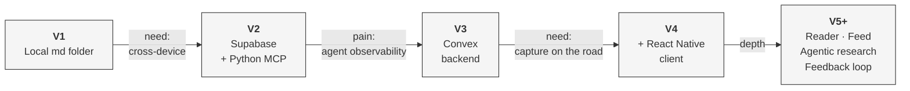
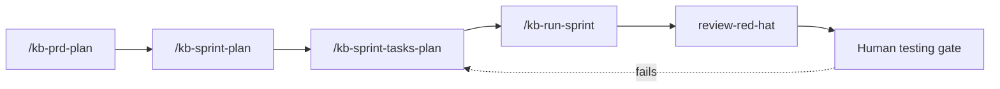

# Holocron — Architectural Walkthrough

<p align="center">
  
</p>

> *"Life moves pretty fast. If you don't stop and look around once in a while, you could miss it."* — Ferris Bueller

That's the project, in one quote. Agentic dev moves faster than the human ability to keep up with what we're learning from it. Holocron is what I built so I don't miss it.

---

A walkthrough of how holocron is structured today, the surfaces it exposes, and how it's built. For the codebase directory layout and file-level guide, see [LAY-OF-THE-LAND.md](./LAY-OF-THE-LAND.md).

---

## What it does

Holocron is personal research infrastructure. It captures research artifacts (deep-research outputs, articles, transcripts, feeds), stores them as a queryable knowledge base, and exposes that knowledge through two surfaces: an MCP-first agent surface (used by Claude Code, Cursor, and similar harnesses) and a React Native mobile client (used for capture, reading, and on-the-go work).

The system is built and maintained through a spec-driven dev pipeline called **kb-* skills**, which orchestrates agents through a defined sequence of planning, implementation, review, and verification steps.

---

## How it got here — five revs in about a month

Each rev addressed a constraint that surfaced from actual use, not from theorizing. The arrows label the pain that drove each migration.



| Rev | What it added | What it solved (or surfaced) |
|---|---|---|
| **V1** | Local markdown folder | Capture — but only at the desk |
| **V2** | Supabase + Python MCP | Cross-device access. Surfaced: devtooling for agents was painful — no real observability into what they were doing. |
| **V3** | Convex backend | Agent-readable observability via MCP. The dev loop became viable; Claude Code could debug holocron through the same surface it used to invoke it. |
| **V4** | React Native client (Expo) | Mobile capture. Most ideas don't happen at the desk; the system needed to be reachable when they do. |
| **V5+** | Document reader · feed · agentic research with follow-ups · feedback loop | Current state. Depth and integration across the surfaces. |

**Underneath every rev:** the **kb-* skills** spec-driven dev system. None of this pace is possible without an orchestration layer that turns specs into shipping units — chat-based dev sessions can't sustain five architectural pivots in a month. (See the kb-* pipeline diagram in [Appendix D](#appendix-d--kb-skills-pipeline--invocation-examples).)

---

## Architecture

```
                ┌──────────────────────────────┐
                │      kb-* skills (dev)       │
                │  spec-driven orchestration   │
                └──────────────┬───────────────┘
                               │ ships everything below
                               ▼
            ┌───────────────────────────────────┐
            │         Convex backend            │
            │  typed functions, storage,        │
            │  agentic research workflows       │
            └─────┬───────────────────────┬─────┘
                  │                       │
        ┌─────────▼──────────┐ ┌──────────▼──────────┐
        │   MCP gateway      │ │   React Native app  │
        │  (agent surface)   │ │   (human surface)   │
        └─────────┬──────────┘ └──────────┬──────────┘
                  │                       │
                  ▼                       ▼
          Claude Code /                Mobile use
          Cursor / agents
```

| Component | Role |
|---|---|
| **Convex backend** | Typed server functions, storage, agentic research workflows. Reactive sync handles cross-device state. |
| **MCP gateway** | Agent-facing API. Exposes tools, resources, logs, status, and runtime state in MCP-native form so harnesses can introspect, query, and reason about the system directly. |
| **React Native client (Expo)** | Mobile-facing client. Capture, document reading, agentic chat, feed, feedback. Single codebase across iOS and Android. |
| **kb-* skills** | Spec-driven dev system that ships every piece of holocron itself. |

*→ For a typed Convex function example, see [Appendix A](#appendix-a--convex-backend-function-as-api). For the full set of examples and the kb-* pipeline diagram, see the [Appendix](#appendix--examples).*

---

## The agent surface — MCP gateway

The MCP gateway is the primary API surface. It is designed to be consumed by agents, not by humans:

- **Function-as-API.** The data layer is abstracted behind Convex server functions; the function signature *is* the API contract. There is no separate REST or GraphQL layer to maintain.
- **Structured observability.** Logs, status, function calls, and runtime state are exposed in a structured format that agents can read, query, and reason about. Agents can debug their own runtime via the same MCP layer they use to invoke tools.
- **Whitelisted exposure.** Sensitive operations are gated; only whitelisted tools and resources are exposed. Auth flows through the harness.
- **Reactivity.** Mobile sync is a side-effect of how Convex's reactive query system already works — clients subscribe to functions and are kept in sync without explicit pub/sub plumbing.

The web UI is intentionally sparse. The product is agent-best and human-good-enough; the human surface is the React Native client, not a web app.

*→ See [Appendix B](#appendix-b--mcp-gateway-tool-definition--invocation) for a real tool definition (`hybridSearch`) and how an agent invokes it from Claude Code.*

---

## The mobile surface — React Native client

The mobile client serves human capture and consumption — the moments that don't happen at a desk.

- **Document reader.** Markdown rendering, swipe navigation, offline cache, optional read-aloud. Lets long-form research artifacts function as readable material on the road.
- **Agentic chat.** Conversational access to research workflows, follow-up questions, and the knowledge base.
- **Feed.** Subscriptions, what's-new reports, signal intelligence.
- **Feedback loop.** Per-result feedback for personalization and quality scoring.

React Native via Expo gives a single codebase across iOS and Android. Convex's RN integration handles reactivity, auth, and offline sync. Most ideas don't happen at a desk; the mobile client exists so the system can be reached when they do.

*→ See [Appendix C](#appendix-c--react-native-client-document-reader) for the document reader source files and entry pattern.*

---

## How holocron is built — kb-* skills

The dev system that ships everything in this repo. Every architectural change goes through the same pipeline:

```
kb-prd-plan  →  kb-sprint-plan  →  kb-sprint-tasks-plan  →  kb-run-sprint  →  review-red-hat  →  human testing
```

Each step's output is the input to the next:

| Step | Output |
|---|---|
| **kb-prd-plan** | Product requirements document |
| **kb-sprint-plan** | Sprint roadmap, where each sprint is organized around a single human-testable gate |
| **kb-sprint-tasks-plan** | Per-task acceptance criteria, expanded from the sprint roadmap |
| **kb-run-sprint** | Tasks executed in dependency order through agent orchestration |
| **review-red-hat** | Adversarial multi-agent review against the implementation |
| **Human testing** | Final verification against the sprint's human-testable gate |

### Quality model

Quality is enforced at every layer of the pipeline, not just at the end:

| Layer | Mechanism |
|---|---|
| **Task** | TDD. Red test first; green implementation. |
| **Parallel work** | Worktree isolation per task. Each task runs in an isolated git worktree with its own agentic review pass before merge. |
| **Commit** | Subagent stop hooks and git commit hooks enforce TypeScript and lint at every commit. Deterministic gates that fire every time. |
| **Sprint** | Human-testable gate. If a sprint's gate doesn't pass, the sprint reworks before shipping. |

These are preventive controls layered through the pipeline. Detective controls — continuous monitoring and scoring of agent outputs over time — are tracked under [Roadmap](#roadmap) below.

*→ See [Appendix D](#appendix-d--kb-skills-pipeline--invocation-examples) for a process diagram and the invocation pattern of each skill in the pipeline.*

---

## How the surfaces compose

The three surfaces (MCP gateway, RN client, kb-* skills) compose into a single data loop. The same knowledge can be created, planned against, and consumed across surfaces:

| Step | Surface | What happens |
|---|---|---|
| 1 | **MCP gateway** | An agent runs deep-research from a harness; results sync to holocron through MCP. |
| 2 | **kb-* skills** | A planning skill (e.g., kb-sprint-plan) pulls research from holocron and produces a roadmap with human-testable gates. |
| 3 | **RN client** | The same research is accessible on mobile, with a document reader supporting read-aloud for travel. |

The data is one repo. The surfaces differ.

---

## Roadmap

Open areas of work where the system is uneven, in priority order:

### 1. Mobile research quality parity

Mobile-derived deep research is currently lower quality than desk-derived research. On the desk, kb-* coordinates multi-agent specialist research with synthesis. On mobile, deep research is a simpler cloud call without the full orchestration layer. Capture velocity is good on mobile; research quality on mobile isn't yet at parity with the harness side.

**Direction:** Route mobile research through the same orchestration layer — either running the harness server-side or porting the research orchestration into Convex itself.

### 2. Continuous monitoring and scoring of agent outputs

Quality is currently enforced at the gate — red-team review, human testing — but it isn't measured continuously. There is structured logging and runtime introspection (preventive controls), but no eval-based regression testing or drift detection (detective controls). Questions like *"has the research workflow's accuracy on a held-out evaluation set drifted this month?"* aren't answerable today.

**Direction:** Build an eval layer — score outputs against rubrics or held-out baselines, track regression over time, surface drift before it propagates downstream.

### 3. Open-source readiness

The kb-* spec system is built around solo velocity. Sharing it with collaborators requires investment in type safety, query performance, component polish, and the spec format itself. See [`/.spec/prd/open-source-readiness/`](../.spec/prd/open-source-readiness/) for the current scope.

---

## Project status

Holocron is a personal tool, used daily, in active development. It is **not** a productized system:

- The web UI is intentionally sparse. Polish lives in the React Native client.
- The kb-* dev system is opinionated for solo work. Onboarding a teammate would require non-trivial investment in making the spec format approachable.
- The document reader was built ad-hoc, outside the kb-* pipeline, in response to a specific need (long-form reading on a road trip). It's the part of the codebase most clearly *outside* the discipline that governs the rest.

The discipline is intentional, not dogmatic. The pipeline holds for everything that needs to hold; some surfaces are deliberately less productized than others.

---

## Appendix — Examples

Concrete examples for each architectural component. Code in this repo is linked relatively; skill files in the separate `brain/` repo are cited by path.

### Appendix A — Convex backend (function-as-API)

Source: [`convex/documents/queries.ts`](../convex/documents/queries.ts)

```typescript
export const get = query({
  args: { id: v.id('documents') },
  handler: async (ctx, args) => {
    return await ctx.db.get(args.id);
  },
});
```

Each `query`, `mutation`, or `action` becomes both an MCP tool (when registered with the gateway) and an internal RPC endpoint. The function signature is the API contract — there is no separate REST or GraphQL layer.

---

### Appendix B — MCP gateway (tool definition + invocation)

Source: [`convex/documents/search.ts`](../convex/documents/search.ts)

The `hybridSearch` action below is exposed to agents through the MCP gateway as `mcp__holocron__hybridSearchTool`. Convex validators (`v.string()`, `v.optional(...)`, `v.array(...)`) define both the input schema and the runtime validation in a single declaration:

```typescript
export const hybridSearch = action({
  args: {
    query: v.string(),
    embedding: v.optional(v.array(v.float64())),
    limit: v.optional(v.number()),
    category: v.optional(v.string()),
  },
  handler: async (ctx, { query, embedding, limit = 10, category }) => {
    // Generate embedding if not provided
    if (!embedding) {
      const { embedding: generatedEmbedding } = await embed({
        model: cohereEmbedding,
        value: query,
      });
      embedding = generatedEmbedding;
    }

    const searchLimit = Math.max(limit * 2, 50);

    // Native Convex vector search + FTS in parallel
    const [nativeVectorResults, ftsResults] = await Promise.all([
      ctx.vectorSearch('documents', 'by_embedding', {
        vector: embedding,
        limit: searchLimit,
        ...(category ? { filter: (q: any) => q.eq('category', category) } : {}),
      }),
      ctx.runQuery(api.documents.queries.fullTextSearch, {
        query,
        limit: searchLimit,
        category,
      }),
    ]);
    // results merged and reranked
  },
});
```

What an agent sees when it invokes this from Claude Code:

```typescript
mcp__holocron__hybridSearchTool({
  query: "MCP vs custom tool protocols",
  limit: 10,
})
```

The agent introspects, queries, and reasons about results in MCP-native form — no separate REST client, no SDK to install.

---

### Appendix C — React Native client (document reader)

Sources:
- [`app/document/[id].tsx`](../app/document/[id].tsx) — full reader route (939 lines)
- [`components/documents/SectionReaderSheet.tsx`](../components/documents/SectionReaderSheet.tsx) — reusable bottom sheet (292 lines)

The reader entry uses Convex's React hooks for live data, plus Expo Router and Reanimated for native polish:

```typescript
import { useAction, useMutation, useQuery } from 'convex/react';
import { useLocalSearchParams } from 'expo-router';
import Animated, { useAnimatedStyle, useSharedValue } from 'react-native-reanimated';
import { MarkdownView } from '@/components/markdown/MarkdownView';
import { useAudioPlayback } from '@/components/narration/hooks/useAudioPlayback';
// ...document live-syncs from Convex via useQuery; markdown renders with
// selection, annotation, and read-aloud handled via useAudioPlayback.
```

The route subscribes via `useQuery` and stays in sync as the same document is updated from elsewhere (Claude Code via MCP, another device, etc.) — no manual refresh, no pull-to-reload.

---

### Appendix D — kb-* skills (pipeline + invocation examples)

Skill source files live in the separate `brain/` repo at `/Users/justinrich/Projects/brain/skills/<skill-name>/SKILL.md`. They're invoked as slash commands in Claude Code.

#### D.1 Pipeline diagram



Each step's output is the input to the next. Sprints are organized around a single human-testable gate; if the gate fails, the sprint reworks (dashed return arrow) before the cycle advances.

#### D.2 kb-prd-plan

**Source:** `brain/skills/kb-prd-plan/SKILL.md` — excerpt below.

````
---
name: kb-prd-plan
description: Plan and create PRDs as folder structure in .spec/prd/ with Claude
  Agent Team (product-manager lead + engineering-manager + ui-designer),
  full-feature scope by default, spec layer classification, semantic versioning,
  and customer feedback integration.
allowed-tools: Read, Write, Edit, AskUserQuestion, Task, Skill, TeamCreate, SendMessage, TeamDelete, Bash
---

# /kb-prd-plan

Plan and create Product Requirements Documents (PRDs) using a Claude Agent Team
with product-manager (lead), engineering-manager, and ui-designer specialists.
PRDs are saved to .spec/prd/ as a folder structure with separate files per
section for AI agent traversability.

Key Features:
- Full-Feature Default: every PRD assumes a complete, fully-polished feature
- Spec Layer Classification: CONSTITUTION / PRODUCT_CONTEXT / FEATURE_SPEC
- Semantic Versioning: automatic version tracking with change history
- Customer Feedback Integration: --feedback flag for mid-flight changes

## QUICK REFERENCE

/kb-prd-plan "<initiative name>" [FLAGS]

FLAGS:
  --edit              Edit existing PRD (full team reprocessing)
  --update "..."      Targeted update without team
  --from-notes        Start from user's notes
  --research          Run user/market research first
  --feedback "..."    Integrate customer feedback (auto-bumps version)

OUTPUT: .spec/prd/<initiative>/ folder with section files:
        README.md, 00-overview.md, 01-scope.md, 02-roles.md,
        03-functional-groups.md, 04-uc-{prefix}.md, ...
        NN-technical-requirements.md
````

**Real example:** [`.spec/prd/open-source-readiness/`](../.spec/prd/open-source-readiness/) — generated by this skill.

#### D.3 kb-sprint-plan

**Source:** `brain/skills/kb-sprint-plan/SKILL.md`

Generates a sprint roadmap from a PRD. Each sprint is organized around a single **human testing gate** — the one sentence a reviewer can verify at the sprint's end. Dispatches implementation and design planners in parallel, groups tasks gate-first, and emits a single `ROADMAP.md` at PRD level. Sprint tasks are expanded just-in-time by `kb-sprint-tasks-plan`.

```
/kb-sprint-plan <PRD_PATH> [FLAGS]

# Common flags:
#   --greenfield      New project, no existing code
#   --delta-replan    Re-plan only sprints affected by PRD changes
```

**Produces:** `<prd-folder>/ROADMAP.md` listing sprints in dependency order, each with its human-testable gate.

#### D.4 kb-sprint-tasks-plan

**Source:** `brain/skills/kb-sprint-tasks-plan/SKILL.md`

Parses `ROADMAP.md` to find the next sprint, generates that sprint's `SPRINT.md` just-in-time, then expands the sprint's task list into per-task markdown files with stable requirement IDs (`AC-N`, `TC-N`), Given-When-Then acceptance criteria, test criteria, guardrails, and a machine-readable `REQUIREMENT-CONTRACT v1` block consumed by `/kb-run-sprint`'s orchestrator state machine. Enforces a 115-point task quality rubric with remediation.

```
/kb-sprint-tasks-plan <ROADMAP_PATH> [FLAGS]
```

**Produces:** A sprint folder containing `SPRINT.md` plus per-task `.md` files, each carrying a stable requirement contract that `/kb-run-sprint` reads to track per-AC / per-TC state across review cycles.

#### D.5 kb-run-sprint

**Source:** `brain/skills/kb-run-sprint/SKILL.md`

Runs sprint task files in dependency order via plan-then-execute orchestration. Per-requirement (AC-N/TC-N) state tracking, reviewer verification, commit enforcement, completion-package gates, anti-stub gates, worktree isolation per task. Cross-harness — works in Claude Code (TaskList) and Codex (`state.json`). Task completion is computed deterministically from per-requirement satisfaction, never from the reviewer's verdict alone.

```
/kb-run-sprint <sprint-id> [FLAGS]

# Common flags:
#   --dry-run         Preview only, no tracker writes
#   --sequential      One task at a time
#   --loop            Continue until all requirements satisfied
#   --limit N         Max parallel tasks per wave (default 4)
#   --no-worktree     Disable isolation (NOT recommended)
```

**Produces:** Tasks executed in isolated worktrees, reviewer-verified, committed back to `main` once their requirements are satisfied.

#### D.6 review-red-hat

**Source:** `brain/skills/review-red-hat/SKILL.md`

Adversarial multi-agent review workflow. Auto-selects project-local specialists from the project's `CLAUDE.md` (or accepts an `--agents` override), dispatches them in parallel against an epic or task, and consolidates findings with confidence scoring: HIGH = 3+ agents agree, MEDIUM = 2 agents, LOW = 1 agent. Produces a comprehensive report with gaps, risks, contradictions, and recommendations.

```
/review-red-hat <task-id-or-path> [FLAGS]

# Common flags:
#   --agents <a> <b>     Override specialist selection
#   --linear             Update linked Linear issue with findings
#   --skip-confirm       Execute without approval prompts
```

**Produces:** `.spec/reviews/red-hat-{timestamp}.md` with prioritized findings, confidence scores, and actionable recommendations.
